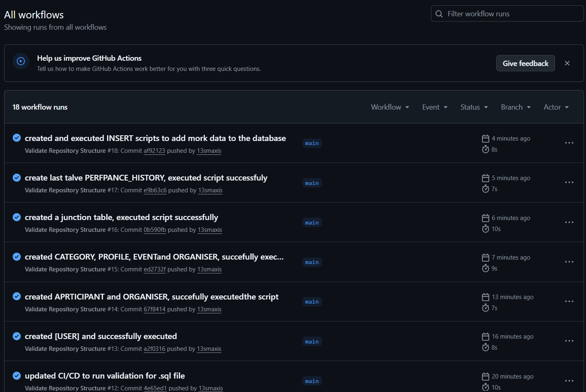

# RaceDay Events Management App

## Overview

RaceDay is an Events Management application designed to manage race events, organisers, participants, event categories, enrolments and race results.

The project includes a SQL Server database design, API endpoint documentation and an Entity Relationship Diagram (ERD).

## Repository Structure

```text
ST10472346-RaceDay-Events-Management-App/
│
├── .github/
│   └── workflows/
│       └── validate-repository-structure.yml
│
├── docs/
│   ├── RaceDay.sql
│   ├── race_day_api_endpoints.pdf
│   └── race_day_erd.pdf
│
└── README.md
```

### Folder Description

| Folder/File                       | Description                                                                     |
| --------------------------------- | ------------------------------------------------------------------------------- |
| `.github/workflows/`              | Contains the GitHub Actions workflow used to validate the repository structure. |
| `docs/RaceDay.sql`                | SQL Server database creation script and sample seed data.                       |
| `docs/race_day_api_endpoints.pdf` | API endpoint documentation for the RaceDay application.                         |
| `docs/race_day_erd.pdf`           | Entity Relationship Diagram showing the database structure.                     |
| `README.md`                       | Project documentation and repository information.                               |

## Database

The `RaceDay.sql` script creates the RaceDay SQL Server database and its related tables.

The database includes entities for:

* Users
* Organisers
* Participants
* Profiles
* Events
* Categories
* Routes
* Enrolments
* Results
* Performance History

The script also contains sample data for testing and demonstration purposes.

## GitHub Actions / CI

GitHub Actions is used to automatically validate the required repository structure whenever changes are pushed to the repository or a pull request is created.

The workflow checks that:

* The `docs` folder exists.
* `RaceDay.sql` exists.
* `race_day_erd.pdf` exists.
* `race_day_api_endpoints.pdf` exists.

### CI/CD Workflow Screenshot

The following screenshot shows the successful GitHub Actions workflow execution:



## Project Demonstration

[▶️ Watch the RaceDay project demonstration on YouTube](https://youtu.be/XM2-w1DWHKk)

## Technologies

* SQL Server
* SQL
* Git
* GitHub
* GitHub Actions

## Project Documentation

All supporting project documentation is stored in the `/docs` folder.

## Author

**ST10472346**
